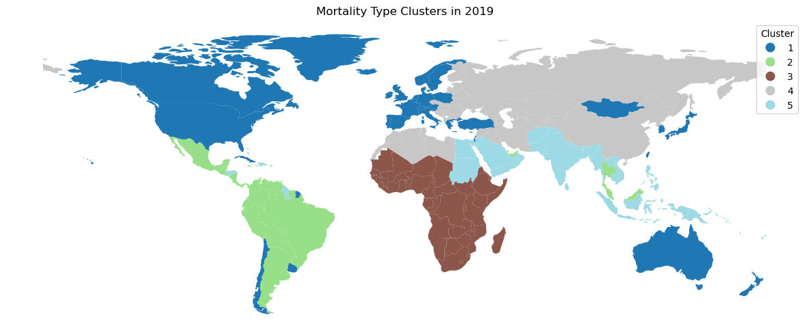
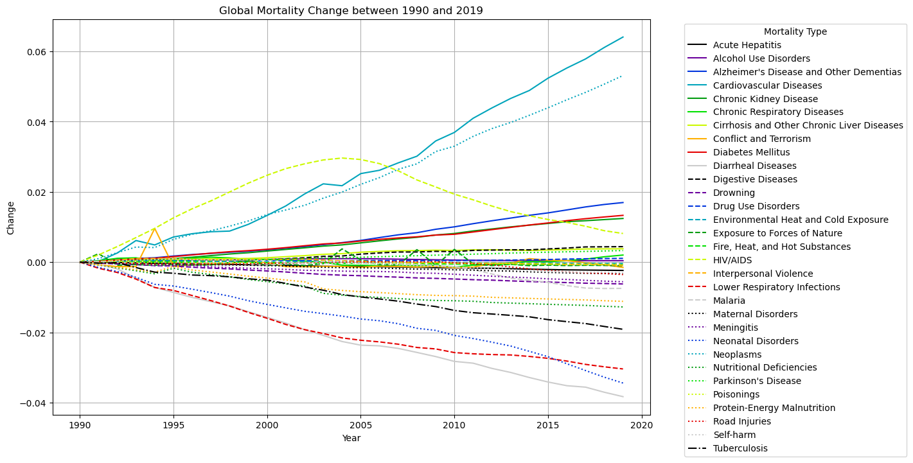
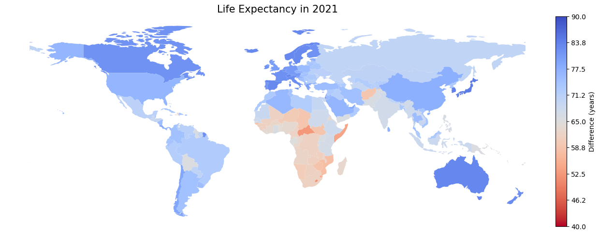
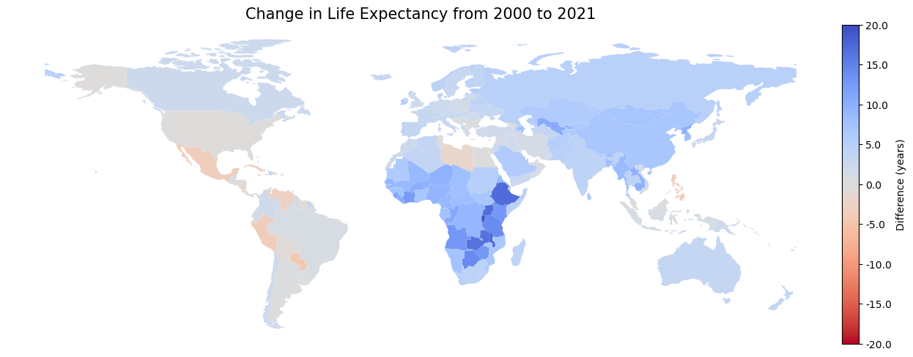

# Global Mortality Analysis

This repository contains all materials related to the paper **Which Lever Should the WHO Pull?**. All code is contained in the [project.ipynb](project.ipynb) file, and the paper is available in both pdf and docx formats.

## Paper Abstract

Countries around the world are facing rapidly evolving healthcare challenges, and both international and local organizations need to make difficult decisions about where to focus their resources to maximize health outcomes. This paper examines the types of challenges faced in various regions of the world, as informed by K-Means clustering. It then examines the Pearson correlations between 31 different mortality categories and assesses the inherent dimensionality of the data using principal component analysis. Next, it creates a predictive model for life expectancy using the mortality category data and performs sensitivity analysis with SHAP values. Lastly, it performs perturbation analysis on the predictive model to determine the mortality category for which a 25% reduction would have the greatest impact on the life expectancy prediction of the model. The model determines that the category of greatest life expectancy impact after a 25% reduction would be cardiovascular diseases for 100 out of 185 countries.

## Interesting Charts

